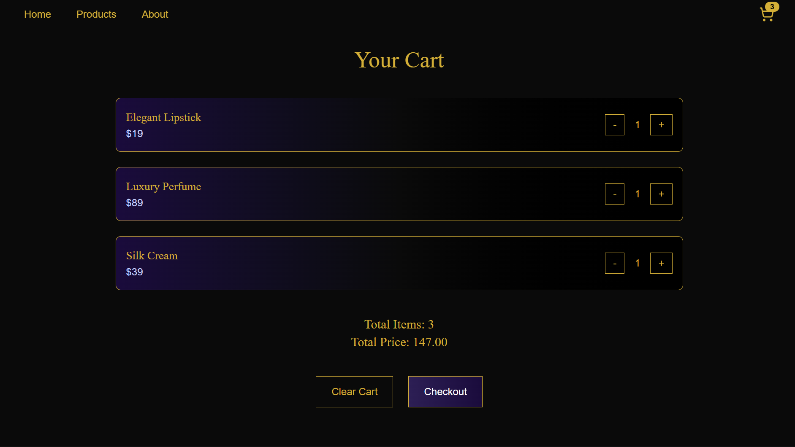
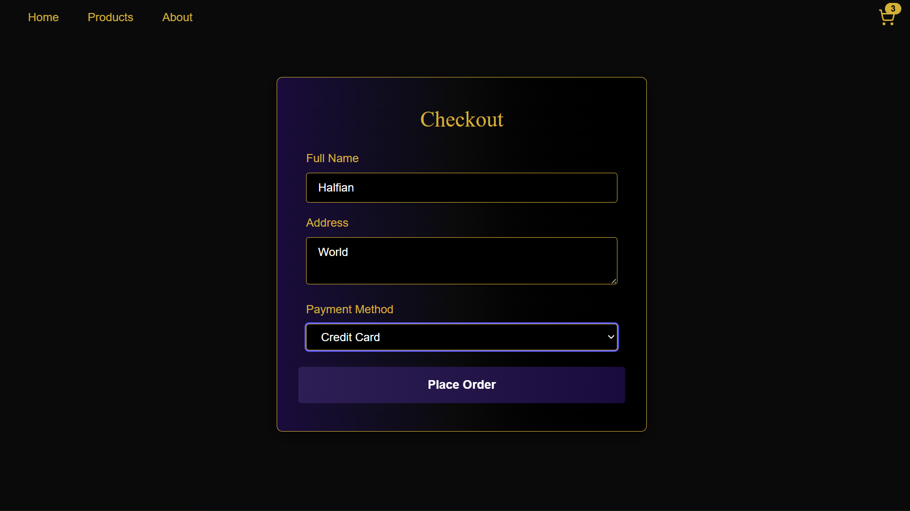

Inspired by my cousin's cosmetics shop in our hometown, I decided to create a landing + e-commerce demo built with React, Zustand, and Tailwind CSS.

Hana with a vision "Beauty in Bloom" try to blend elegant branding with modern luxury to create a refined digital experience. I tried to show on responsive layout through product catalog search and filter, and also cart and checkout integration to feel like a real e-commerce page.

Tech stack I am using is React + Vite for fast dev server and component-base UI, Zustand for lightweight state management, and Tailwind CSS for styling.

I tried to make this project to showcase my detail on UI/UX but still thinking on scalable architecture of the project.

## Screenshots 📸

### Hero Section

### Products Page

### Cart

### Checkout

